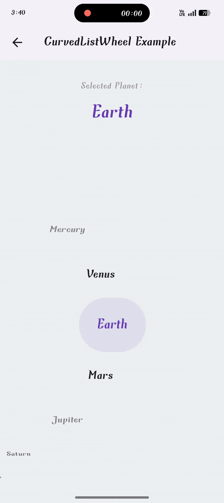
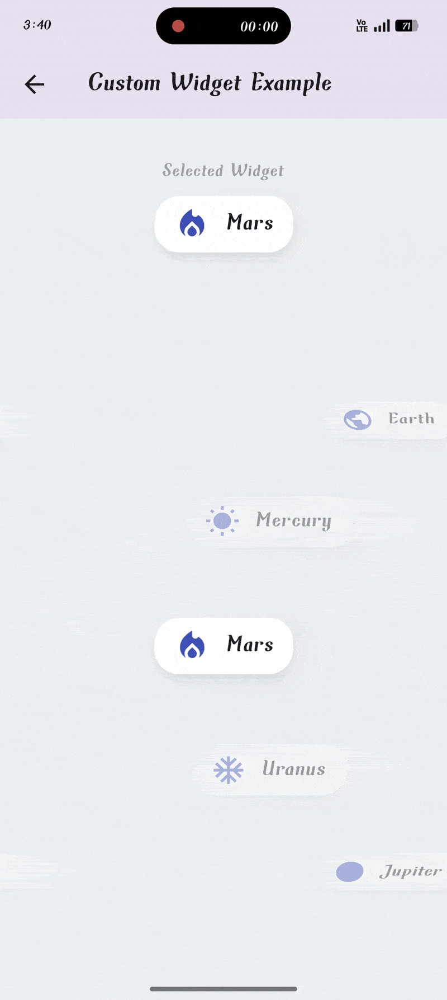

<div align="center">
  <h1>CurvedListWheel</h1>
  <p>
    A highly customizable Flutter list wheel widget that scrolls items along a beautiful, configurable curved path.
  </p>
  
  <!-- Badges -->
  <a href="https://pub.dev/packages/curved_list_wheel"></a>
  <a href="https://pub.dev/packages/flutter_lints"></a>
  <a href="https://opensource.org/licenses/MIT"></a>
  <a href="https://github.com/AdhamElagaty/curved_list_wheel"></a>

</div>

---

**`CurvedListWheel`** brings a dynamic and engaging user experience to your app, perfect for pickers, onboarding screens, and showcasing items in a visually appealing way. It supports vertical/horizontal scrolling, infinite loops, and gives you full control over item styling based on their position.

## ✨ Demos

| Simple Text | Custom Widgets | Advanced Onboarding UI |
| :---: | :---: | :---: |
|  |  |  |

## 📚 Table of Contents

- [Features](#-features)
- [Installation](#-installation)
- [Quick Start: Basic Usage](#-quick-start-basic-usage)
- [Deep Dive: Customization](#-deep-dive-customization)
  - [⚙️ Wheel Geometry & Feel (`CurvedListWheelSettings`)](#️-wheel-geometry--feel-curvedlistwheelsettings)
  - [📳 Haptic Feedback](#-haptic-feedback)
  - [🎨 Styling Items (`itemBuilder` & `CurvedListItemState`)](#-styling-items-itembuilder--curvedlistitemstate)
    - [Using `CurvedListWheelTextItem` Helper](#using-curvedlistwheeltextitem-helper)
    - [Building Custom Widgets](#building-custom-widgets)
  - [↔️ Scroll Direction & Curve Side (`CurvedListWheelSide`)](#️-scroll-direction--curve-side-curvedlistwheelside)
  - [🔁 Infinite Scrolling](#-infinite-scrolling)
  - [🕹️ Programmatic Control (`FixedExtentScrollController`)](#️-programmatic-control-fixedextentscrollcontroller)
- [🚀 Advanced Example Showcase](#-advanced-example-showcase)
- [API Reference](#-api-reference)
- [Contributing](#-contributing)
- [License](#-license)

## 🌟 Features

-   **Beautiful Curved Path Scrolling**: Items animate along a quadratic Bézier curve.
-   **Haptic Feedback**: Built-in support for haptic feedback on item selection with customizable intensity.
-   **Multi-Axis Support**: Configure the curve on the `left`, `right`, `top`, or `bottom`.
-   **State-Driven UI**: `itemBuilder` provides `CurvedListItemState` (`isSelected`, `distance`) for powerful conditional styling and animations.
-   **Infinite Scrolling**: Loop the list indefinitely for continuous picking.
-   **Rich Customization**: Use `CurvedListWheelSettings` to control item extent, curve tightness, highlight box, and more.
-   **Helper Widgets**: Includes `CurvedListWheelTextItem` and `CurvedListWheelTextStyle` for effortless, distance-based text styling.
-   **Controller Support**: Natively works with `FixedExtentScrollController` for programmatic control.
-   **Highly Performant**: Built on top of Flutter's efficient `ListWheelScrollView`.

## 📦 Installation

Add the package to your `pubspec.yaml` file:

```yaml
dependencies:
  curved_list_wheel: ^1.1.0 # Check pub.dev for the latest version
```

Then, install it by running the command in your terminal:
```sh
flutter pub get
```

## 🚀 Quick Start: Basic Usage

Import the package and create a simple `CurvedListWheel` with a list of strings.

```dart
import 'package:flutter/material.dart';
import 'package:curved_list_wheel/curved_list_wheel.dart';

class PlanetPicker extends StatefulWidget {
  @override
  _PlanetPickerState createState() => _PlanetPickerState();
}

class _PlanetPickerState extends State<PlanetPicker> {
  final _items = ['Mercury', 'Venus', 'Earth', 'Mars', 'Jupiter'];
  int _selectedIndex = 2;

  @override
  Widget build(BuildContext context) {
    return CurvedListWheel<String>(
      items: _items,
      initialItem: _selectedIndex,
      onSelectedItemChanged: (index) {
        setState(() {
          _selectedIndex = index;
        });
      },
      // The itemBuilder provides state information for dynamic styling.
      itemBuilder: (context, index, item, itemState) {
        // Use the helper for easy, beautiful text styling.
        return CurvedListWheelTextItem(
          text: item,
          itemState: itemState,
          style: const CurvedListWheelTextStyle(),
        );
      },
    );
  }
}
```

## 🛠️ Deep Dive: Customization

Unlock the full potential of `CurvedListWheel` by customizing its appearance and behavior.

### ⚙️ Wheel Geometry & Feel (`CurvedListWheelSettings`)

The `settings` property lets you control the core mechanics of the wheel.

```dart
final settings = CurvedListWheelSettings(
    // The height of each item in the list.
    itemExtent: 80.0,
    // A larger value creates a more pronounced curve.
    pathCurveFactor: 0.8,
    // Show or hide the central highlight box.
    showHighlight: true,
    highlightColor: Colors.deepPurple.withAlpha(50),
    // For vertical lists, this is a fraction of the available width.
    highlightWidthFactor: 0.7,
    highlightBorderRadius: BorderRadius.circular(16),
);

CurvedListWheel(
    // ...
    settings: settings,
);
```

| Property                  | Description                                                                 |
| ------------------------- | --------------------------------------------------------------------------- |
| `itemExtent`              | The fixed extent of each item along the scroll axis (height for vertical).  |
| `pathCurveFactor`         | Controls the "tightness" of the curve. Higher is more curved.               |
| `showHighlight`           | Toggles the visibility of the central highlight area.                       |
| `highlightColor`          | The color of the highlight box.                                             |
| `highlightWidthFactor`    | The highlight box's width as a fraction of the available cross-axis space.  |
| `highlightHeightFactor`   | The highlight box's height (for horizontal wheels). Defaults to width factor. |
| `highlightBorderRadius`   | The border radius of the highlight box.                                     |

### 📳 Haptic Feedback

Improve the user experience with tactile feedback. The wheel can produce a haptic response each time a new item is selected. This is also configured in `CurvedListWheelSettings`.

```dart
final settings = CurvedListWheelSettings(
    // ... other settings
    enableHapticFeedback: true,
    hapticFeedbackIntensity: HapticFeedbackIntensity.heavy,
);

CurvedListWheel(
    // ...
    settings: settings,
);
```

| Property                  | Description                                                                 |
| ------------------------- | --------------------------------------------------------------------------- |
| `enableHapticFeedback`    | Set to `true` to enable haptic feedback. Defaults to `true`.                |
| `hapticFeedbackIntensity` | Controls the strength of the feedback. Options include `.light`, `.medium`, `.heavy`, `.selection`, and `.vibrate`. |

### 🎨 Styling Items (`itemBuilder` & `CurvedListItemState`)

This is the most powerful feature. The `itemBuilder` gives you `CurvedListItemState`, which contains:
- `bool isSelected`: `true` if the item is in the center.
- `int distance`: The absolute distance from the selected item (`0` for selected, `1` for immediate neighbors, etc.).

#### Using `CurvedListWheelTextItem` Helper
For text wheels, this is the easiest way to get great results. `CurvedListWheelTextStyle` allows you to define styles for different states.

```dart
const textStyle = CurvedListWheelTextStyle(
  // Style for the centered item
  selectedStyle: TextStyle(
    fontSize: 24,
    fontWeight: FontWeight.bold,
    color: Colors.deepPurple,
  ),
  // Default style for all other items
  unselectedStyle: TextStyle(
    fontSize: 18,
    color: Colors.black54,
  ),
  // Override styles for items at a specific distance from the center
  distanceSpecificStyles: {
    1: TextStyle(fontSize: 22, color: Colors.black87, fontWeight: FontWeight.w600),
    2: TextStyle(fontSize: 20, color: Colors.black45),
  },
);

// Inside itemBuilder:
return CurvedListWheelTextItem(
    text: item,
    itemState: itemState,
    style: textStyle,
);
```

#### Building Custom Widgets
You are not limited to text. Build any widget you want and use `itemState` to apply conditional styling.

```dart
// Inside itemBuilder:
return AnimatedOpacity(
  duration: const Duration(milliseconds: 200),
  opacity: itemState.isSelected ? 1.0 : 0.4,
  child: AnimatedScale(
    duration: const Duration(milliseconds: 200),
    scale: itemState.isSelected ? 1.0 : 0.7,
    child: MyCustomPlanetWidget(itemData: item),
  ),
);
```

### ↔️ Scroll Direction & Curve Side (`CurvedListWheelSide`)

Control the scroll direction and where the curve appears using the `side` property.

- `CurvedListWheelSide.left` (Default): Vertical scroll, curve on the left.
- `CurvedListWheelSide.right`: Vertical scroll, curve on the right.
- `CurvedListWheelSide.top`: Horizontal scroll, curve on the top.
- `CurvedListWheelSide.bottom`: Horizontal scroll, curve on the bottom.

```dart
CurvedListWheel(
  // ...
  side: CurvedListWheelSide.right,
);
```

### 🔁 Infinite Scrolling

Set `isInfinite: true` to create a list that wraps around seamlessly. This is perfect for pickers like a birth year selector.

```dart
CurvedListWheel(
  // ...
  isInfinite: true,
);
```

### 🕹️ Programmatic Control (`FixedExtentScrollController`)

Pass your own `FixedExtentScrollController` to control the wheel programmatically.

```dart
// In your State class
final _scrollController = FixedExtentScrollController(initialItem: 10);

// In your build method
CurvedListWheel(
  // ...
  controller: _scrollController,
);

// Later, to jump to an item:
_scrollController.animateToItem(
  20,
  duration: const Duration(milliseconds: 500),
  curve: Curves.easeInOut,
);
```

## 🚀 Advanced Example Showcase

By combining the features of `CurvedListWheel` with other Flutter widgets, you can create stunning and responsive UIs like our advanced onboarding example.


This screen demonstrates:
- **`isInfinite: true`** for the year picker.
- **Custom `CurvedListWheelTextStyle`** for responsive font sizes.
- **`FixedExtentScrollController`** to listen to scroll offsets.
- **Combining with other animated widgets**, like the rotating background pattern whose rotation is tied to the scroll offset.
- **A fully responsive layout** that adapts to different screen sizes.

## 📝 API Reference

| Class                         | Description                                                                                             |
| ----------------------------- | ------------------------------------------------------------------------------------------------------- |
| `CurvedListWheel<T>`          | The main widget for creating the curved list.                                                           |
| `CurvedListItemState`         | Provides state (`isSelected`, `distance`) to the `itemBuilder` for conditional styling.                 |
| `CurvedListWheelSettings`     | Configures the visual appearance and geometry of the wheel (item extent, curve, highlight).             |
| `CurvedListWheelSide`         | Enum to define the curve's position and scroll axis (`left`, `right`, `top`, `bottom`).               |
| `HapticFeedbackIntensity`     | Enum to define the haptic feedback strength on selection.                                               |
| `CurvedListWheelTextItem`     | A helper widget for displaying text that reacts to `CurvedListItemState`.                               |
| `CurvedListWheelTextStyle`    | A theme object to define styles for `CurvedListWheelTextItem` based on selection and distance.          |

## ❤️ Contributing

Contributions are welcome! If you find a bug or have a feature request, please [file an issue](https://github.com/AdhamElagaty/curved_list_wheel/issues). If you want to contribute code, please open a pull request.

1.  Fork the repository.
2.  Create your feature branch (`git checkout -b feature/amazing-feature`).
3.  Commit your changes (`git commit -m 'Add some amazing feature'`).
4.  Push to the branch (`git push origin feature/amazing-feature`).
5.  Open a Pull Request.

## 📜 License

This project is licensed under the MIT License - see the [LICENSE](LICENSE) file for details.